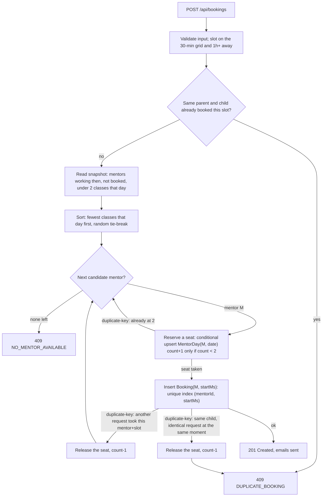

# Codeyoung Trial Class Booking

A production-minded take-home implementation for the Codeyoung trial-class booking assignment.

## Stack
- Frontend: React + Vite
- Backend: Node.js + Express
- Database: MongoDB + Mongoose
- Time zones: Luxon + IANA zones 
- Email: Nodemailer (Gmail SMTP or Ethereal fallback)

## Product flow
1. Parent chooses their time zone (auto-detected) and a date.
2. Available 30-minute slots are shown in the parent's local time, grouped by morning/afternoon/evening.
3. Parent enters parent name/email and child name/age.
4. The backend assigns an eligible mentor fairly, with a hard maximum of 2 demo classes per mentor per mentor-local calendar day. The same parent and child cannot book the same slot twice.
5. Parent and mentor each receive a confirmation email with the time in **their own** time zone and the same demo classroom link.
6. The confirmation page offers Google Calendar, .ics, copy-link, and the demo classroom.

If no mentor is free (the slot was just taken, or the day is full) the parent sees a friendly message, the slot list refreshes, and the next date with availability is suggested.

## Scheduling decisions
- Bookings are stored as UTC epoch milliseconds.
- User-facing times are rendered using IANA time zones such as `America/New_York` and `Europe/London`.
- DST is therefore handled by the timezone library rather than hard-coded offsets.
- Mentors are seeded in India time (`Asia/Kolkata`) and work 09:00–21:00 local time.
- Slots are 30 minutes and must be at least 1 hour in the future.
- A mentor can host at most 2 classes per mentor-local calendar day.
- The same child (same parent email and child name, ignoring capitalisation and extra spaces) cannot book the same time slot twice. A repeat attempt gets `409 DUPLICATE_BOOKING` and the parent sees a clear message.
- The least-loaded eligible mentor is preferred, with a random tie-break.

## Concurrency / race safety
The backend uses three MongoDB constraints: a unique `(mentorId, startMs)` booking index prevents double-booking, and a unique `(mentorId, date)` `MentorDay` document is incremented conditionally while the count is below 2. A third unique index on `(childKey, startMs)` stops the same child being booked twice for one slot, even when several identical requests arrive at once. If a race for a mentor is lost, the service tries another mentor or returns `NO_MENTOR_AVAILABLE`; if the child already holds the slot, it returns `DUPLICATE_BOOKING` and gives the mentor's seat back.

## Email and classroom link
Set `APP_URL` to the URL where the React app is served. The backend generates the demo classroom URL (`<APP_URL>/#/class/<id>`), stores it on the booking, and returns it, so the confirmation page and both emails always show the same link. The classroom is a demo page served by the React app, as the brief allows.

For Gmail, use a Google **App Password**, not your normal Gmail password. If `SMTP_HOST` is empty, the server uses an Ethereal test inbox and logs the preview URL.

## Environment
Create `server/.env` from `server/.env.example`. Do not commit `.env`. Example:

```env
MONGODB_URI=mongodb://127.0.0.1:27017/codeyoung_trials
PORT=4000
CLIENT_URL=http://localhost:5173
APP_URL=http://localhost:5173

# Optional. Leave these out to use the Ethereal test inbox (a preview URL is printed in the server console).
# SMTP_HOST=smtp.gmail.com
# SMTP_PORT=587
# SMTP_USER=your-email@gmail.com
# SMTP_PASS=your-gmail-app-password
# MAIL_FROM="Codeyoung <your-email@gmail.com>"
```

## Run locally
You need Node.js 18 or newer (20+ recommended) and a MongoDB database, either local (`mongod` or Docker) or a free MongoDB Atlas cluster. For Atlas, allow your IP under Network Access and put the connection string in `MONGODB_URI`. The 10 mentors are created automatically on first start.

Backend:
```bash
cd server
npm install
npm start
```
Frontend in another terminal:
```bash
cd client
npm install
npm run dev
```

Open `http://localhost:5173`.

Tests (they use an in-memory MongoDB, so the first run downloads a temporary MongoDB binary and needs internet):
```bash
cd server
npm test
```
If `npm test` fails on an older Node version, run `node --test --test-concurrency=1 test/*.test.js` instead.

## How the capacity cap and double-booking protection work

10 mentors x 2 classes per day = at most 20 bookings per mentor-day cycle, and a mentor can never be in two classes at once. Both rules are enforced **by the database**, not by "check then insert" in application code, so they hold with many simultaneous requests or several server instances.



| Rule | Mechanism | What it stops |
|---|---|---|
| A mentor never has 2 classes at the same time | Unique index on `Booking(mentorId, startMs)` | Two parents grabbing the same mentor and slot at once: one insert wins, the other gets a duplicate-key error and moves on to the next mentor |
| A mentor never exceeds 2 classes a day | `MentorDay(mentorId, date)` counter, unique index, incremented by a conditional upsert (`count < 2`) | The check-then-book race. At the cap the filter no longer matches, so the upsert tries to insert a second row for the same key and collides with the unique index, which is a refusal rather than a silent overbook |
| The same child cannot hold one slot twice | `Booking.childKey` (parent email + child name, normalised) with a unique index on `(childKey, startMs)`, checked first and enforced again by the database | A parent or a double-click booking the same child at the same time more than once; each repeat would otherwise have gone to a different mentor |
| "Day" means the mentor's day | `date` is the mentor's local (IST) calendar date | Parents in different zones booking the same IST day |

The availability read in step C is only a hint to avoid pointless attempts; the two atomic writes in F and G are what guarantee correctness. That is why the tests fire 30 simultaneous requests at one IST day and assert exactly 20 succeed with no mentor above 2, and fire 5 identical requests for one child and assert exactly 1 succeeds.

## API
- `GET /api/health` — health check
- `GET /api/slots?date=YYYY-MM-DD&tz=IANA_ZONE` — availability
- `POST /api/bookings` — create a trial booking

Error responses have the shape `{ "code": "...", "message": "..." }`. Booking codes: `INVALID_SLOT` (400), `SLOT_IN_PAST` (400), `VALIDATION_ERROR` (400), `NO_MENTOR_AVAILABLE` (409), `DUPLICATE_BOOKING` (409), `RATE_LIMITED` (429).

Booking payload:
```json
{
  "name": "Parent Name",
  "email": "parent@example.com",
  "childName": "Child Name",
  "childAge": 10,
  "tz": "Europe/London",
  "startUtc": "2026-10-12T10:00:00.000Z"
}
```

## Front-end design
The interface follows the Codeyoung brand: a yellow panel with the logo block shape, teal ink for text, and the Outfit typeface. Chosen dates and times are shown in dark ink, and only the main action buttons are yellow, so the next step is always obvious. The layout is responsive: the brand panel stays in place beside the booking card on desktop and becomes a header on phones. Times always show their zone (for example EDT or IST), and the confirmation screen shows both the parent's time and the mentor's time.

## Deliberately out of scope
Real Zoom/Google Meet integration, payments, accounts/login, parent cancellation and rescheduling, a "find my booking" lookup, mentor dashboards and an admin panel were left out on purpose: the brief is about scheduling correctness (time zones, DST, capacity, races), and each of these adds surface area without strengthening that core. The dummy classroom satisfies requirement 3.

## Not production-ready
The assignment did not ask for any of the items below, so they were left out on purpose to keep the work focused on scheduling correctness (time zones, DST, capacity and races). This is an honest list of what the project does **not** do:
- **Rate limits are per process and per IP** (`express-rate-limit`, in memory: 10 bookings / 15 min and 120 slot reads / min per IP, returning `429 RATE_LIMITED`). With several instances each keeps its own counters (use a shared store such as Redis), they reset on restart, and behind a proxy you must set `TRUST_PROXY`. They do not stop someone using many IPs to book all the seats; that needs CAPTCHA or email verification.
- **Bookings are not email-verified**, so anyone can book with someone else's address.
- **The duplicate check compares text**: the same child with a different email address or a different spelling of the name is treated as a different booking. Email verification would close this.
- **No cancel/reschedule**: a parent who needs to change a time has to contact support. A booking can't be released from the UI.
- **Email is fire-and-forget**: a failed send is logged, not retried, and the booking stays valid. Use a queue and a transactional provider (SES, Postmark) rather than Gmail SMTP.
- **The classroom is a demo page**, not a real video room.
- **No authentication, request logging, monitoring, or data-retention policy** for parent and child details.
- **Mentor hours are fixed** (09:00-21:00 IST, seeded in `mentors.js`); there is no leave/availability management.
- There are server tests (time zones/DST, capacity, concurrency, rate limiting) but no browser UI tests.

## Security / submission notes
- Never commit `server/.env` or credentials.
- Use an App Password for Gmail.
- Keep the MongoDB URI private.
- The included `.env.example` contains placeholders only.

## AI usage
`TRANSCRIPT.md` contains the AI sessions used during development, including the later session that added the duplicate-booking protection and the front-end redesign.
